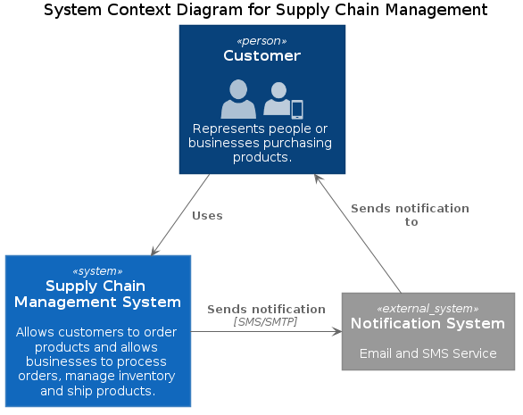
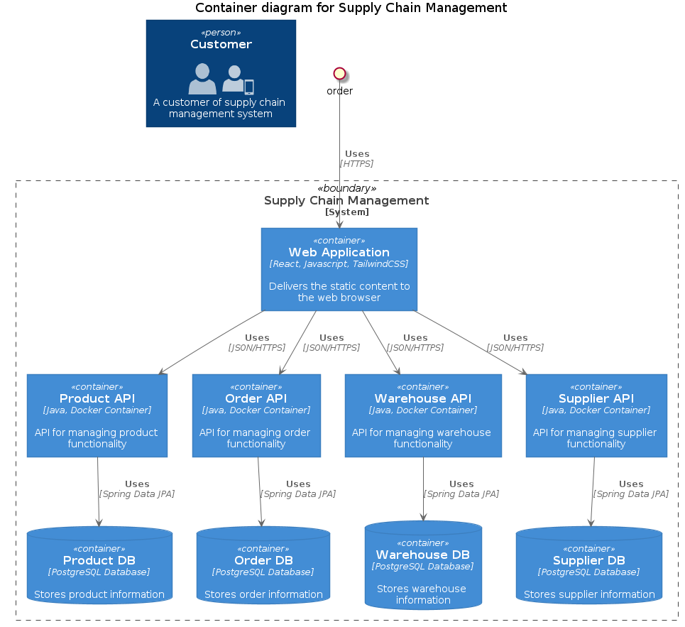
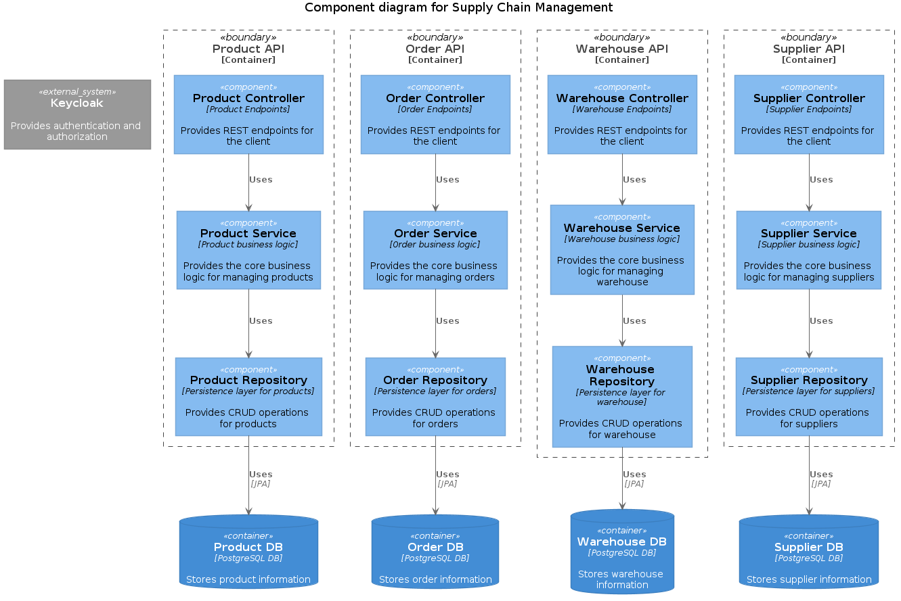
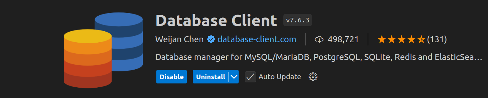
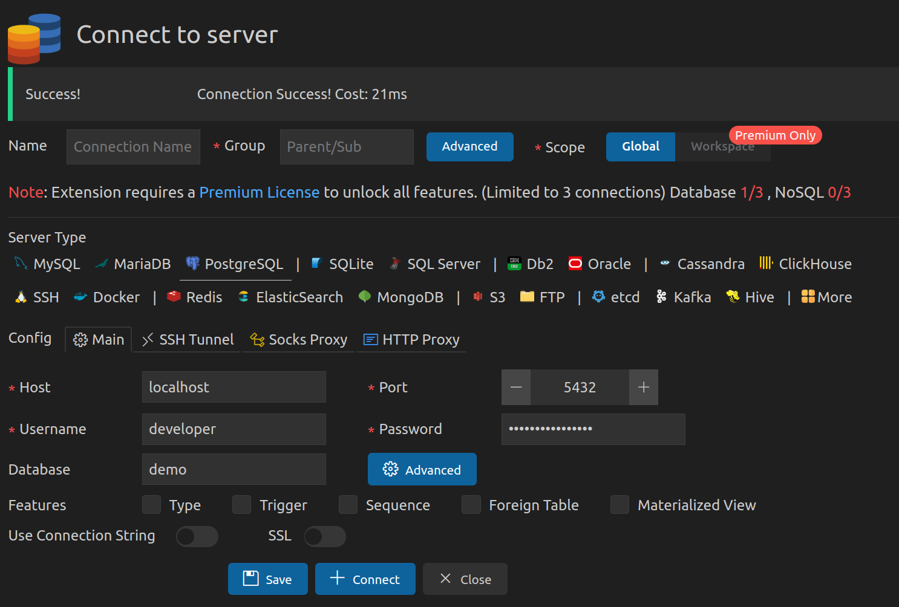
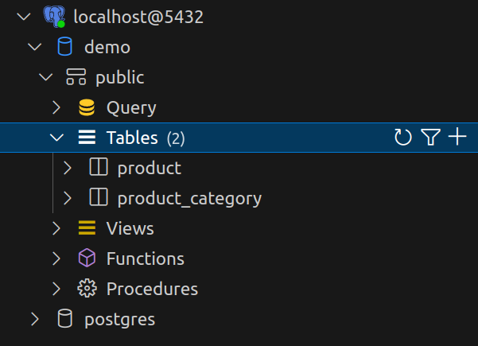

= Supply Chain Management Microservices

Sample application of a supply chain management application using Spring Boot 
microservices. This is for educational purposes and does not represent a real
application as that would typically be far more complex in the real world.

== Overview

This application is a simple supply chain management application that allows
users to manage products, suppliers, warehouse, inventory, orders, customers, 
shipments, and payments. The application is implemented using Spring Boot
microservices and demonstrates bounded contexts, domain-driven design, and 
event-driven architecture.

=== Context Diagram

== Modules

The application is divided into the following modules:

* `product-service`: Manages products and categories.
* `warehouse-service`: Manages warehouses and inventory.
* `supplier-service`: Manages suppliers.
* `order-service`: Manages orders and customers.

=== Container Diagram

=== Component Diagram

== Local Development Setup

To build and run the application, you need to have Java 17, Docker, and Kubernetes 
installed on your machine. I use minikube to run a single node kubernetes cluster. 
Installing and using minikube is very simple and you can install it on Linux, Mac, 
and Windows.

https://minikube.sigs.k8s.io/docs/start

=== Install PostgreSQL in Minikube

In the `k8s` directory, you will find the Kubernetes manifests to deploy PostgreSQL.
To deploy PostgreSQL in minikube, run the following command:

[source,shell]
----
kubectl apply -f k8s/postgres-cm.yml
kubectl apply -f k8s/postgres-secret.yml
kubectl apply -f k8s/postgres-pvc.yml
kubectl apply -f k8s/postgres-deployment.yml
kubectl apply -f k8s/postgres-service.yml
----

You can check the status of the deployment using the following command:

[source,shell]
----
kubectl get pods
kubectl get svc
----

=== Viewing the Database

Your PostgreSQL database should be up and running. You can connect to the database
using a VSCode extension. However, before you connect to the database, you'll need
to forward the port from the postgres pod to your localhost. Use the following 
commands to get the pod name and forward the port:

[source,shell]
----
kubectl get pods --namespace default
kubectl port-forward postgres-5b6478f95-2b66r 5432:5432
----

==== Connecting to the Database

You can now connect to the database using the VSCode extension. You can use any 
database client to connect to the database, but I recommend using the VSCode with 
this extension:

With the port forwarded, you can now connect to the database.

Once you're connected, you can view the tables and data in the database.

